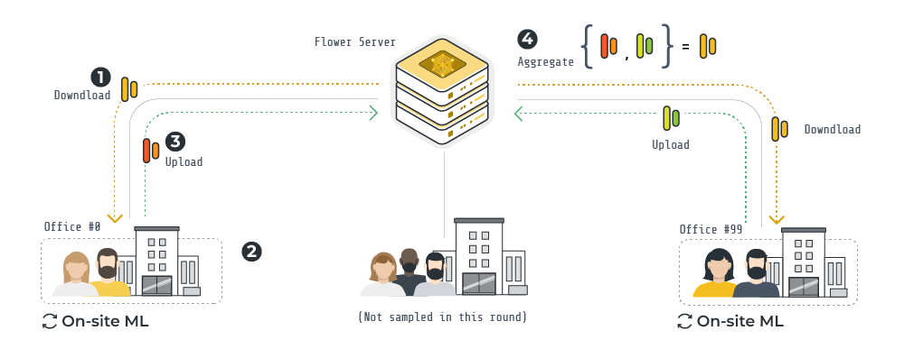

# Federated Keyword Spotting with Flower

This example demonstrates how to federated the training of a small CNN for the task of keyword spotting. We'll be using Flower involving a total of 100 clients. As for the dataset, we'll be using the [Google Speech Commands](https://huggingface.co/datasets/speech_commands) dataset for keyword spotting. This examples uses [Flower Datasets](https://flower.ai/docs/datasets/) to download the Google Speech Commands and to partition it into 100 groups of unique speakers.



## Install dependencies and project

```bash
pip install -e .
```

## Run with the Simulation Engine

> [!TIP]
> Refer to the [How to Run Simulations](https://flower.ai/docs/framework/how-to-run-simulations.html) guide in the documentation for advice on how to optimize your simulations.

From the current directory, launch the run:

```shell
flwr run .
```

You can also override some of the settings for your `ClientApp` and `ServerApp` defined in `pyproject.toml`. For example:

```shell
# Do 10 FL rounds and sample 50% of the clients each round
flwr run . --run-config "num-server-rounds=10 fraction-fit=0.5"
```

## Run with the Deployment Engine

Follow this [how-to guide](https://flower.ai/docs/framework/how-to-run-flower-with-deployment-engine.html) to run the same app in this example but with Flower's Deployment Engine. After that, you might be interested in setting up [secure TLS-enabled communications](https://flower.ai/docs/framework/how-to-enable-tls-connections.html) and [SuperNode authentication](https://flower.ai/docs/framework/how-to-authenticate-supernodes.html) in your federation.

You can run Flower on Docker too! Check out the [Flower with Docker](https://flower.ai/docs/framework/docker/index.html) documentation.

## More resources

- Flower website: [flower.ai](https://flower.ai/)
- Check the documentation: [flower.ai/docs](https://flower.ai/docs/)
- Give Flower a ⭐️ on GitHub: [GitHub](https://github.com/adap/flower)
- Join the Flower community!
  - [Flower Slack](https://flower.ai/join-slack/)
  - [Flower Discuss](https://discuss.flower.ai/)
